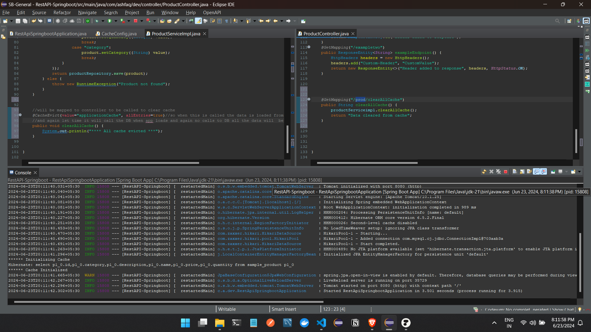
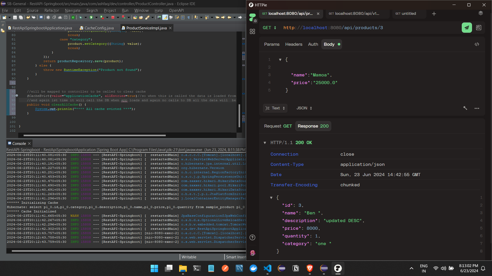
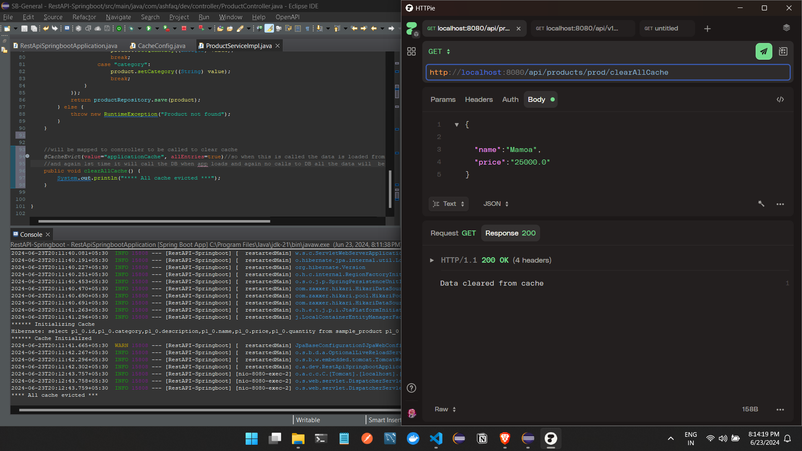
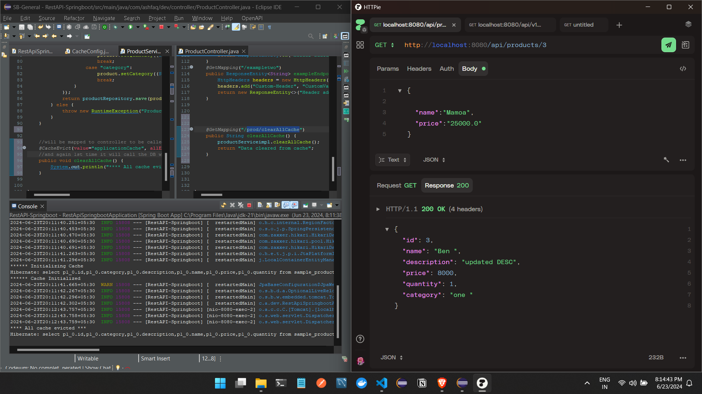
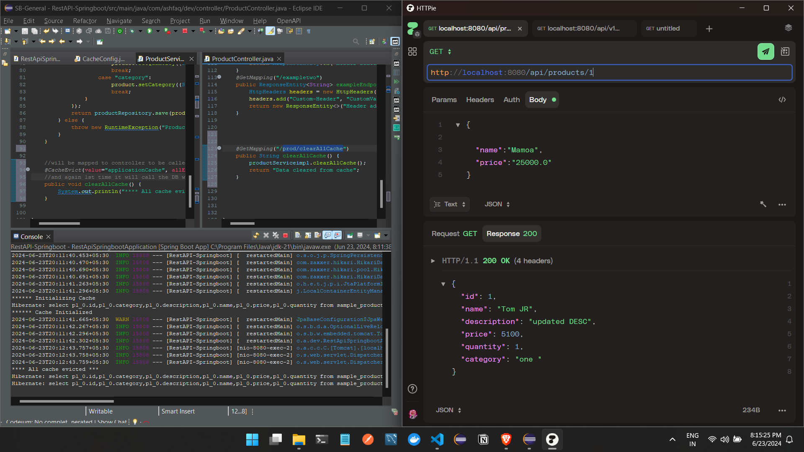
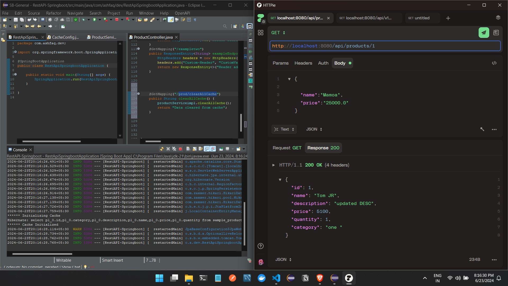
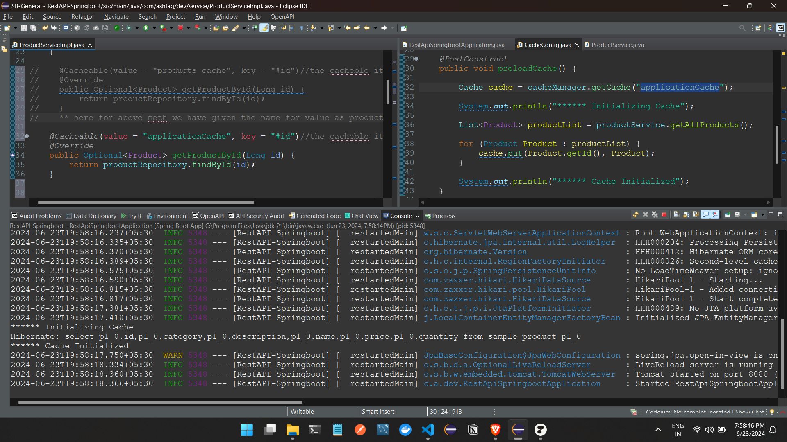
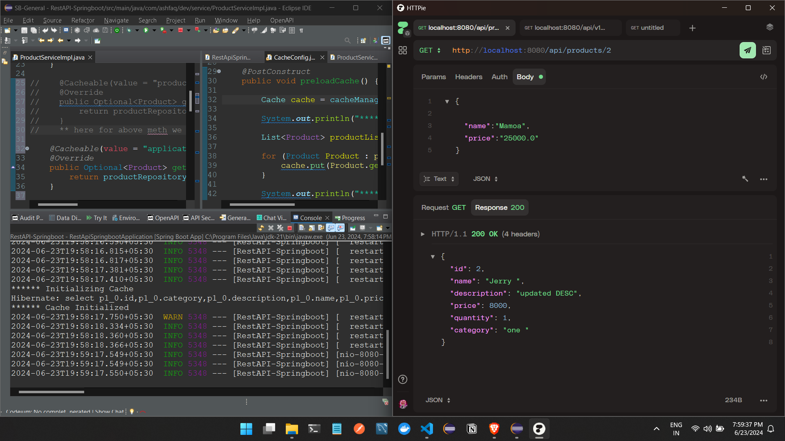
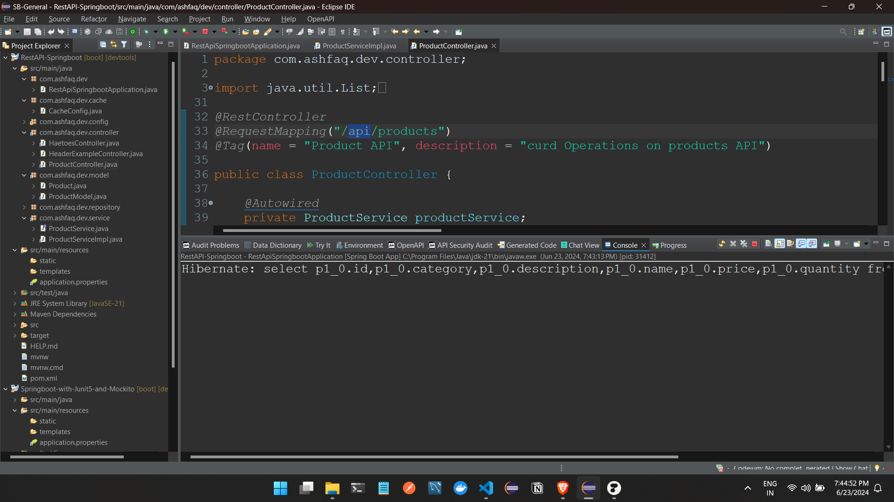
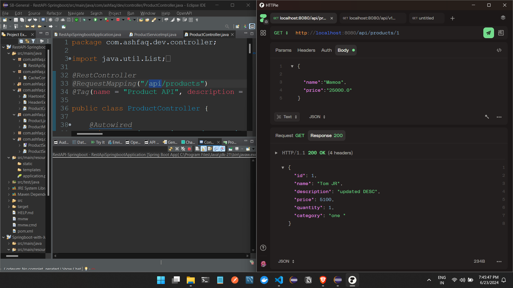

SPRINGBOOT CACHING 

WE HAVE TO TELL THE SPRINGBOOT APPLICATION TWO THINGS TO ENABLE CHACHABILITY BY

1 @ENABLECHACHING WE CAN ADD THIS ANYWHERE BUT WE IT  SHOULD BE INVOKED during the start of the application so make the class @configuration

2 now we have to the springboot application what exactly we have to cache so we have to add     @Cacheable() on the serivces

3 so now for the frist time we dont want to call the DB , so we have to to load all the data from the database and then add it to the cache 

4 now for above we need to clear the cache so we when we call the api for the first time it will call the DB and then never unless again we clear the cache 

data is loaded from the database and then to the cache now api calles to confirm
 

no DB calls as we can see in the logs

now lets call the clear cache api and then call the api to get prod by ID to check

call from the DB can be seen
calling the prod id 1 

we can see in the logs db call for the 1st time then next time no calls as the data is stored in cache
and again if the app is restarted the data is stored in cache

service > controller flow 

5 now not all the data to be removed from the cache only the id for the product called only that to be removed 
 
     @CacheEvict(value="applicationCache", key="#id")
     public void clearDataFromCache(Long id) {
		System.out.println("**** Data evicted from Cache : "+id);
	}     

and to the controller    

as we can see in the logs the application starts and the DB called the api 

and now if we call the API we can see in logs no DB calls 

1st time call 

second time call so call to the DB and the data is saved in the memory cache

only 1st time call will be called from the database for the api next time from memory cache

